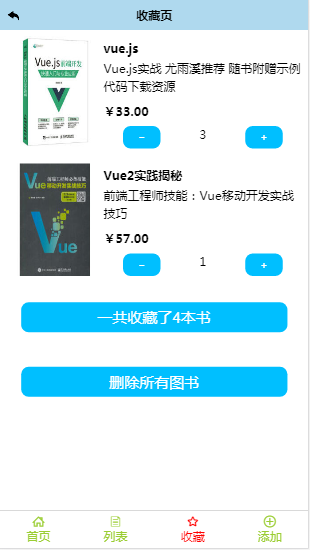

## 图书管理应用
利用自己所学技术写的一个简单项目
## 使用说明
```
# 克隆项目
git clone 
# 进入vue-book安装依赖
cd vue-book
npm install
# 启动本地数据库服务
node server.js
# 本地开发环境 访问http://localhost:8080
npm start
# 构建生产
npm run build
```
## 技术栈
- vue2.0+vue-router+vuex（vue全家桶）
- scroll(滑动)+下拉刷新+点击刷新+vue-lazyload(懒加载)+vue-awesome-swiper(轮播)
- es6（javascript核心规范）
- nodeJs
- less（css预处理器）
- axios（数据请求）
- flex布局

## 主要功能
- loading动画
- 前台数据图片懒加载
- 前台向后台请求数据时有数量限定（比如一次返回 5 条数据）
- 广告轮播图
- 下拉刷新
- 点击刷新
- 回退
- 修改图书信息
- 删除图书
- 添加图书
- 收藏图书
## Demo && 演示




## 主要文件说明
- mock 模拟数据
- api 代表的是所有的接口
- base 基础组件
- components 页面组件
- store Vuex 状态管理

## 写一个基础组件
  1. 创建一个.vue文件
  2. 在需要使用这个组件的父组件中引入这个组件
  3. 在组件中注册
  4. 以标签的形式引入

## 主要功能实现思想
- 先写服务端，确保数据能正常返回
- 增加api方法，实现调取数据的功能
- 在那个组件中应用这个api,如果是一个基础组件需要用这些数据，在使用
这个组件的父级中调用这个方法，将数据传递给基础组件

## 路由元信息
- 实现页面级的缓存

## 下拉加载
 - 默认每次加载5条，前台告诉后台要从第几条开始给
 - 后台返回数据告诉前端，并告诉前端有没有更多数据
    + 防止乱发请求:等请求完成后再发请求（定义一个标识符）
    + 计算偏移量（原来的数据和新获取的书籍相加）
    + 防抖和节流:触发scroll事件可能触发n次，可以先设置一个定时器，下次触发时将上一个清除

## code split 代码分割

## 心得与遗憾
- 要是在写代码之前先认认真真地把项目各个模块的流程图（或逻辑流程图）先画出来的话，感觉写代码效率会大大提高。（或者说写代码之前先把产品整体的构思与架构先画个图表示出来）
-遗憾的是：node封装的不是很好，模拟的后台数据，没用到数据库
